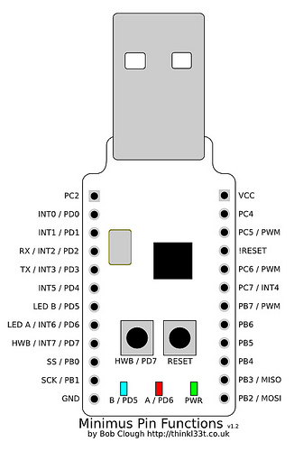

# Program minimus

    ↓rst ↓hwb ↑rst ↑hwb
   sudo make flash

# Data sheets

http://www.atmel.com/Images/doc7707.pdf

http://www.atmel.com/Images/doc7799.pdf

# Reference sites

http://team-xecuter.com/forums/threads/56496-Minimus-AVR-USB-Dev-Kit

http://rlab.org.uk/wiki/Projects/Minimus

http://rlab.org.uk/wiki/Projects/Minimus32

http://jamie.lentin.co.uk/embedded/minimus

# Schematics

[Schematics](minimus32.pdf)

